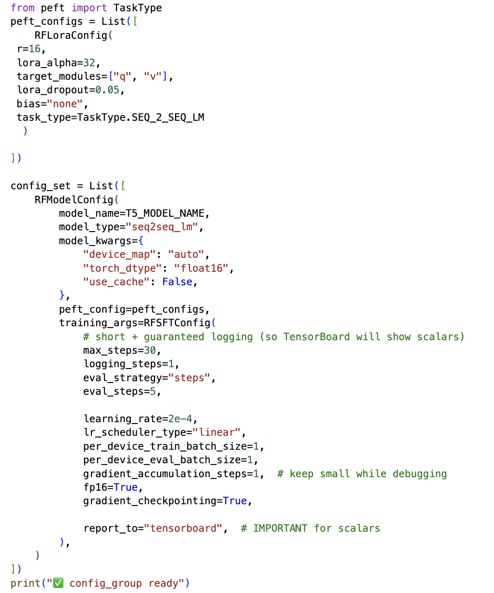
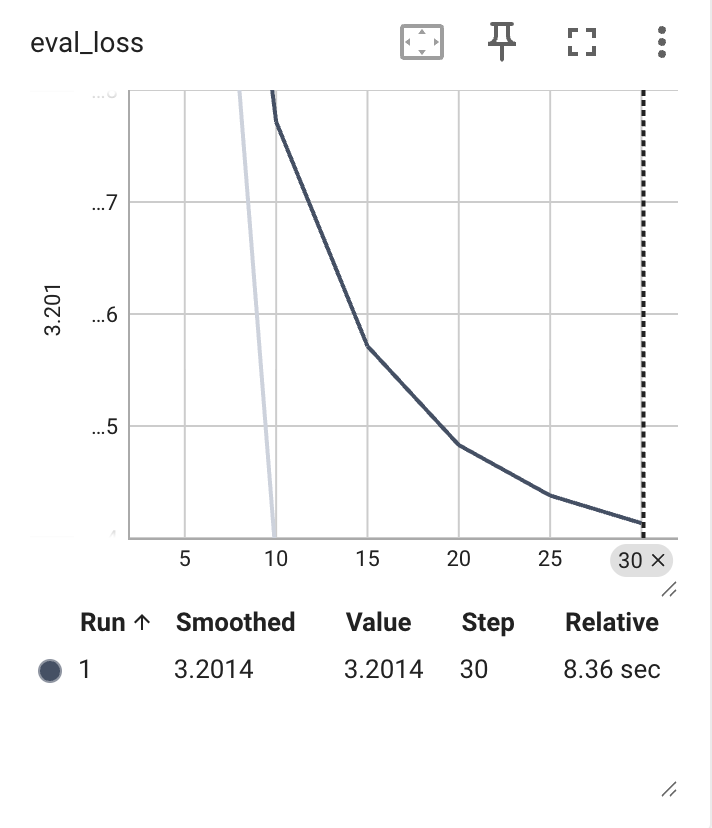
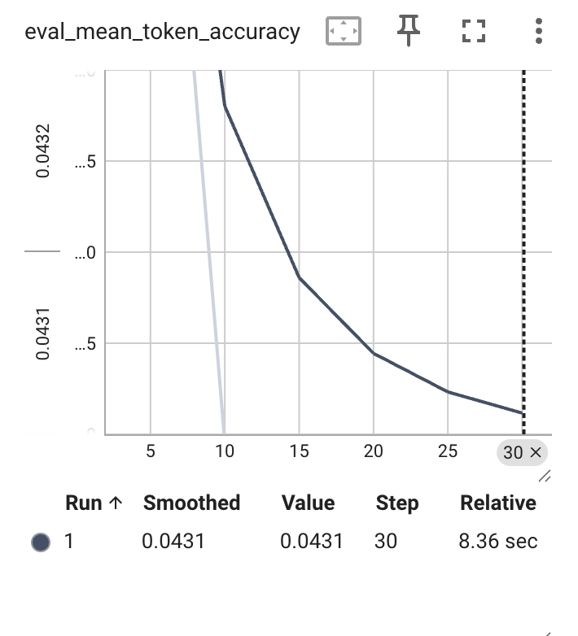
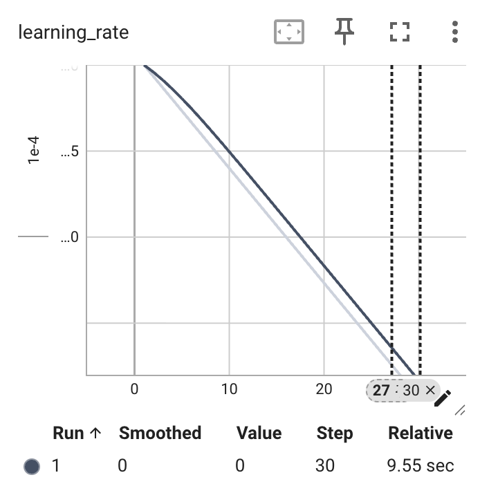
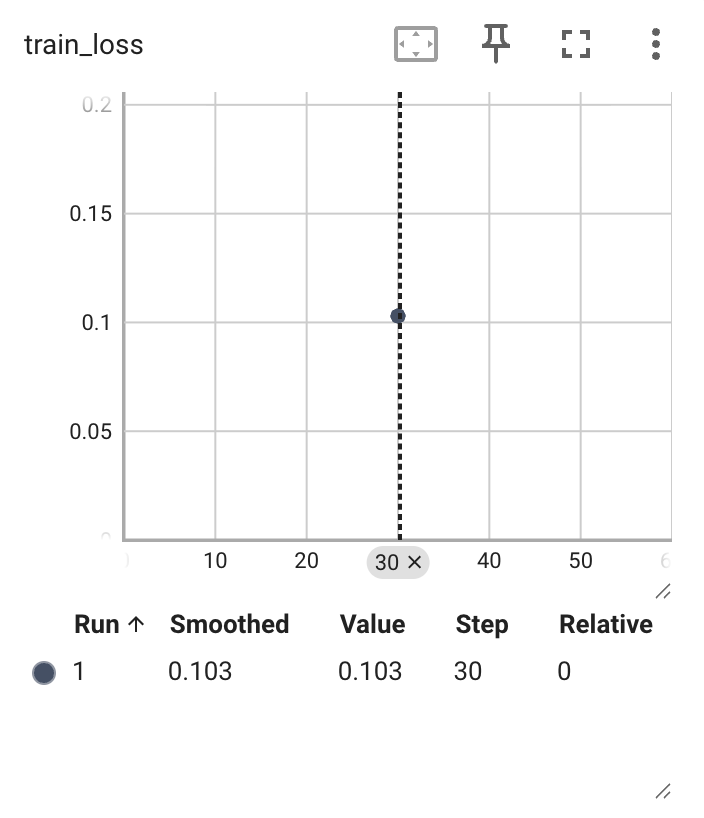
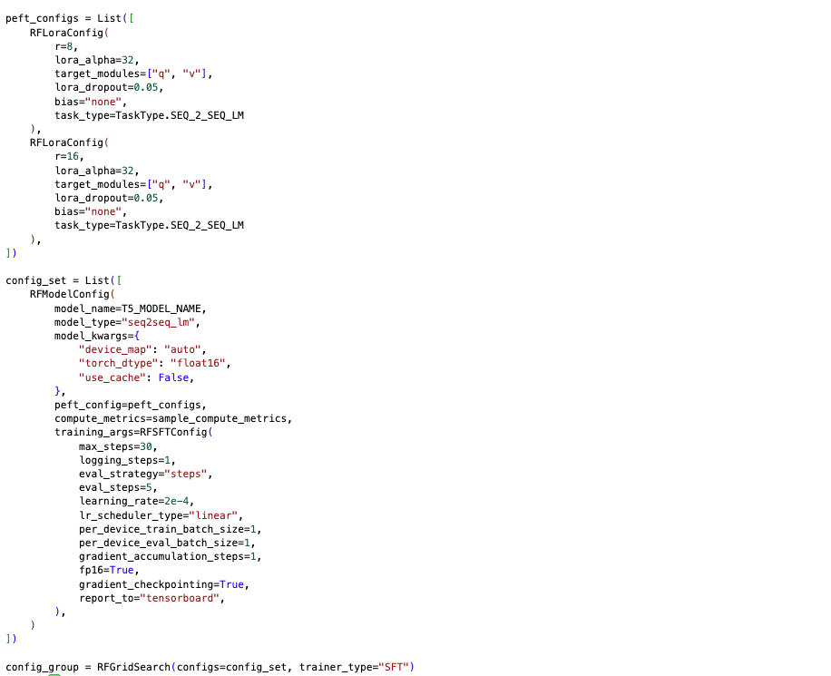
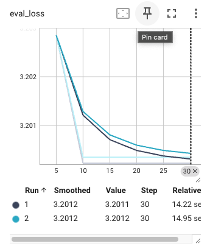
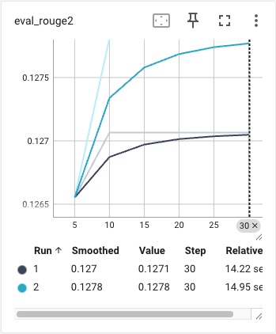
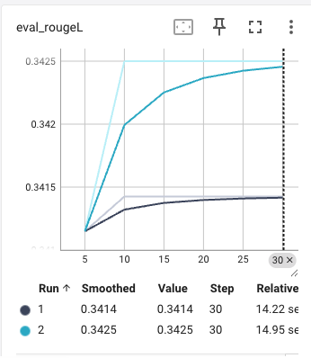

## Abstract

We present a comprehensive study of supervised fine-tuning (SFT) for instruction-based academic paper summarization using RapidFire AI, a framework designed for reproducible machine learning experimentation. Our work focuses on fine-tuning pretrained encoder-decoder language models to generate concise, abstract-style summaries from full academic papers, guided by explicit natural-language instructions. The task requires preserving key technical terminology, emphasizing main contributions and results, and maintaining formal academic tone while omitting low-level implementation details.

Using RapidFire AI, we conduct systematic experiments comparing different model configurations and parameter-efficient fine-tuning strategies. Our baseline experiment establishes a foundation using T5 (Text-to-Text Transfer Transformer) with LoRA (Low-Rank Adaptation) for efficient fine-tuning. Experiment A investigates the impact of LoRA rank on summarization quality by comparing r=8 versus r=16 configurations, measuring performance through ROUGE metrics and evaluation loss. Experiment B (work in progress) extends this analysis to compare different base model architectures, specifically T5 versus BART (Bidirectional and Auto-Regressive Transformer), to understand how pretraining inductive biases affect academic summarization performance.

All experiments leverage RapidFire's integrated TensorBoard logging and grid search capabilities, enabling reproducible comparisons across configurations with clear metric artifacts. The framework's structured approach to experiment management, combined with comprehensive logging and visualization tools, demonstrates an effective methodology for systematic model evaluation and configuration optimization in instruction-following tasks.

## RapidFire Workflow

The RapidFire AI framework provides a structured pipeline for conducting reproducible SFT experiments. The following workflow outlines the key steps, from initial setup through training execution and result visualization.

### 1. Starting RapidFire Services

RapidFire services must be running before experiments can be executed. This code checks if services are active and launches them if needed.

```python
import subprocess
from time import sleep
import socket
try:
  s = [socket.socket(socket.AF_INET, socket.SOCK_STREAM), socket.socket(socket.AF_INET, socket.SOCK_STREAM), socket.socket(socket.AF_INET, socket.SOCK_STREAM)]
  s[0].connect(("127.0.0.1", 8851))
  s[1].connect(("127.0.0.1", 8852))
  s[2].connect(("127.0.0.1", 8853))
  s[0].close()
  s[1].close()
  s[2].close()
  print("RapidFire Services are running")
except OSError as error:
  print("RapidFire Services are not running, launching now...")
  subprocess.Popen(["rapidfireai", "start"])
  sleep(30)
```

### 2. TensorBoard Setup

TensorBoard integration enables real-time monitoring of training metrics and visualization of experiment results.

```python
import os

# Load TensorBoard extension
%load_ext tensorboard

# TensorBoard log directory will be auto-created in experiment path
```

### 3. Importing Components

Essential RapidFire components are imported to configure experiments, define model configurations, and manage grid searches.

```python
from rapidfireai import Experiment
from rapidfireai.automl import List, RFGridSearch, RFModelConfig, RFLoraConfig, RFSFTConfig
```

### 4. Loading Datasets

The arXiv academic summarization dataset provides article-abstract pairs for training and evaluation.

```python
from datasets import load_dataset

# Load dataset
dataset = load_dataset("ccdv/arxiv-summarization")

# REDUCED dataset for Colab stability (IMPORTANT)
train_dataset = dataset["train"].select(range(64)).shuffle(seed=42)      # 64 examples
eval_dataset  = dataset["validation"].select(range(16)).shuffle(seed=42) # 16 examples

print("Train size:", len(train_dataset))
print("Eval size:", len(eval_dataset))
```

### 5. Baseline Experiment Setup

The baseline experiment configuration includes several components:

- **Preprocessing function**: Formats examples into input-target pairs with instruction prompts
- **Metric function**: Computes ROUGE scores for evaluation
- **Initialize experiment**: Creates a new RapidFire experiment instance
- **TensorBoard log directory**: Retrieves the path for logging
- **Model configurations**: Defines LoRA and training parameters
- **Config group/grid search**: Sets up the experiment grid

#### Preprocessing Function

```python
BASE_SUMMARIZATION_INSTRUCTION = (
    "Summarize the following academic paper into a concise abstract. "
    "Preserve key technical terms, emphasize the main contributions and results, "
    "and use formal academic tone.")

def format_example(ex):
    return {
        "input_text": f"{BASE_SUMMARIZATION_INSTRUCTION}\n\nPaper:\n{ex['article']}",
        "target_text": ex["abstract"],
    }

# Apply mapping (creates the exact columns we train on)
train_dataset = train_dataset.map(format_example, remove_columns=train_dataset.column_names)
eval_dataset  = eval_dataset.map(format_example,  remove_columns=eval_dataset.column_names)
```

#### Tokenization

```python
from transformers import AutoTokenizer

model_name = "google/flan-t5-small"
tokenizer = AutoTokenizer.from_pretrained(model_name)

max_source_len = 512   # T4-safe
max_target_len = 128   # T4-safe

def tokenize_seq2seq_fixed(batch):
    # Encoder: fixed-length padding
    enc = tokenizer(
        batch["input_text"],
        max_length=max_source_len,
        truncation=True,
        padding="max_length",
    )

    # Decoder targets: fixed-length padding
    dec = tokenizer(
        batch["target_text"],
        max_length=max_target_len,
        truncation=True,
        padding="max_length",
    )

    labels = dec["input_ids"]
    pad_id = tokenizer.pad_token_id

    # Convert pad tokens to -100 so loss ignores them
    labels = [[(-100 if tok == pad_id else tok) for tok in seq] for seq in labels]
    enc["labels"] = labels
    return enc

tokenized_train_T5 = train_dataset.map(
    tokenize_seq2seq_fixed,
    batched=True,
    remove_columns=train_dataset.column_names,
)
tokenized_eval_T5 = eval_dataset.map(
    tokenize_seq2seq_fixed,
    batched=True,
    remove_columns=eval_dataset.column_names,
)
```

#### Metric Function

```python
def sample_compute_metrics_T5(eval_preds):
    import numpy as np
    import evaluate
    from transformers import AutoTokenizer

    model_name = "google/flan-t5-small"  # worker-safe (no notebook globals)
    tokenizer = AutoTokenizer.from_pretrained(model_name)
    rouge = evaluate.load('rouge')

    preds, labels = eval_preds

    if isinstance(preds, tuple):
        preds = preds[0]

    if hasattr(preds, "ndim") and preds.ndim == 3:
        preds = np.argmax(preds, axis=-1)

    labels = np.where(labels != -100, labels, tokenizer.pad_token_id)

    decoded_preds = tokenizer.batch_decode(preds, skip_special_tokens=True)
    decoded_labels = tokenizer.batch_decode(labels, skip_special_tokens=True)

    decoded_preds = [s.strip() for s in decoded_preds]
    decoded_labels = [s.strip() for s in decoded_labels]

    scores = rouge.compute(
        predictions=decoded_preds,
        references=decoded_labels,
        use_stemmer=True,
        rouge_types=["rouge1", "rouge2", "rougeL", "rougeLsum"],
    )
    return {k: float(v) for k, v in scores.items()}
```

#### Initialize Experiment

```python
EXPERIMENT_NAME = "academic_summarization_baseline"
experiment = Experiment(experiment_name=EXPERIMENT_NAME)
```

#### TensorBoard Log Directory

```python
# Get experiment path
from rapidfireai.fit.db.rf_db import RfDb

db = RfDb()
experiment_path = db.get_experiments_path(EXPERIMENT_NAME)
tensorboard_log_dir = f"{experiment_path}/tensorboard_logs/{EXPERIMENT_NAME}"

print(f"TensorBoard logs will be saved to: {tensorboard_log_dir}")
```

#### Model Configurations

```python
from peft import TaskType

peft_configs = List([
    RFLoraConfig(
        r=16,
        lora_alpha=32,
        target_modules=["q", "v"],
        lora_dropout=0.05,
        bias="none",
        task_type=TaskType.SEQ_2_SEQ_LM
    )
])

T5_MODEL_NAME = "google/flan-t5-small"

config_set = List([
    RFModelConfig(
        model_name=T5_MODEL_NAME,
        model_type="seq2seq_lm",
        model_kwargs={
            "device_map": "auto",
            "torch_dtype": "float16",
            "use_cache": False,
        },
        peft_config=peft_configs,
        compute_metrics=sample_compute_metrics_T5,
        training_args=RFSFTConfig(
            # short + guaranteed logging (so TensorBoard will show scalars)
            max_steps=30,
            logging_steps=1,
            eval_strategy="steps",
            eval_steps=5,
            learning_rate=2e-4,
            lr_scheduler_type="linear",
            per_device_train_batch_size=1,
            per_device_eval_batch_size=1,
            gradient_accumulation_steps=1,  # keep small while debugging
            fp16=True,
            gradient_checkpointing=True,
            report_to="tensorboard",  # IMPORTANT for scalars
        ),
    )
])

def sample_create_model(model_config):
    """Create model + tokenizer (sample notebook style), adapted for seq2seq."""
    from transformers import AutoModelForSeq2SeqLM, AutoTokenizer
    import torch

    model_name  = model_config["model_name"]
    model_kwargs = model_config.get("model_kwargs", {}).copy()

    if model_kwargs.get("torch_dtype") == "float16":
        model_kwargs["torch_dtype"] = torch.float16
    elif model_kwargs.get("torch_dtype") == "bfloat16":
        model_kwargs["torch_dtype"] = torch.bfloat16

    model = AutoModelForSeq2SeqLM.from_pretrained(model_name, **model_kwargs)
    tokenizer = AutoTokenizer.from_pretrained(model_name, use_fast=True)

    model.config.use_cache = False
    return (model, tokenizer)

config_group = RFGridSearch(
    configs=config_set,
    trainer_type="SFT"
)
print("✅ config_group ready")
```

### 6. Start TensorBoard + Run Training

TensorBoard is launched to monitor training progress, then the experiment is executed.

```python
%tensorboard --logdir {tensorboard_log_dir}
```

```python
experiment.run_fit(
    config_group,
    sample_create_model,
    tokenized_train_T5,
    tokenized_eval_T5,
    num_chunks=1,  # keep 1 for Colab stability
    seed=42,
)
```

### 7. End Experiment

After training completes, the experiment is formally ended to finalize logging and cleanup.

```python
experiment.end()
print("Done!")
```

### 8. View Plots + Logs

TensorBoard provides visualization of training metrics, evaluation scores, and other logged artifacts.

```python
# View final logs
%tensorboard --logdir {tensorboard_log_dir}
```

## Baseline Experiment

The baseline experiment establishes a foundation using T5-small with LoRA rank r=16. The configuration uses a reduced dataset size (64 training examples, 16 validation examples) for computational efficiency while maintaining experimental validity.

The baseline demonstrates the RapidFire workflow with a single configuration, providing a reference point for subsequent experiments that vary LoRA parameters or base model architectures.

### Baseline Metrics

<div class="baseline-metrics">











</div>

## Experiment A: LoRA Rank Comparison

LoRA (Low-Rank Adaptation) is a parameter-efficient fine-tuning method that introduces trainable low-rank matrices into transformer layers, enabling effective adaptation with minimal parameter overhead. By comparing different LoRA ranks, we investigate how adapter capacity affects summarization quality. Higher ranks provide more expressiveness but require more parameters and computation.

Experiment A compares LoRA rank r=8 versus r=16 while holding all other factors constant (base model, prompt scheme, training budget). This isolates the effect of adapter capacity on summarization quality, measured through ROUGE metrics and evaluation loss.

### Experiment A Configuration

```python
EXPERIMENT_NAME = "academic_summarization_expA_lora_rank"
experiment = Experiment(experiment_name=EXPERIMENT_NAME)
print("✅ Initialized:", EXPERIMENT_NAME)

from rapidfireai.fit.db.rf_db import RfDb

db = RfDb()
experiment_path = db.get_experiments_path(EXPERIMENT_NAME)
tensorboard_log_dir = f"{experiment_path}/tensorboard_logs/{EXPERIMENT_NAME}"

print(f"TensorBoard logs will be saved to: {tensorboard_log_dir}")

from peft import TaskType

peft_configs = List([
    RFLoraConfig(
        r=8,
        lora_alpha=32,
        target_modules=["q", "v"],
        lora_dropout=0.05,
        bias="none",
        task_type=TaskType.SEQ_2_SEQ_LM
    ),
    RFLoraConfig(
        r=16,
        lora_alpha=32,
        target_modules=["q", "v"],
        lora_dropout=0.05,
        bias="none",
        task_type=TaskType.SEQ_2_SEQ_LM
    ),
])

config_set = List([
    RFModelConfig(
        model_name=T5_MODEL_NAME,
        model_type="seq2seq_lm",
        model_kwargs={
            "device_map": "auto",
            "torch_dtype": "float16",
            "use_cache": False,
        },
        peft_config=peft_configs,
        compute_metrics=sample_compute_metrics_T5,
        training_args=RFSFTConfig(
            max_steps=30,
            logging_steps=1,
            eval_strategy="steps",
            eval_steps=5,
            learning_rate=2e-4,
            lr_scheduler_type="linear",
            per_device_train_batch_size=1,
            per_device_eval_batch_size=1,
            gradient_accumulation_steps=1,
            fp16=True,
            gradient_checkpointing=True,
            report_to="tensorboard",
        ),
    )
])

config_group = RFGridSearch(configs=config_set, trainer_type="SFT")
print("✅ Experiment A config_group ready")
```

### Experiment A Training

```python
%tensorboard --logdir {tensorboard_log_dir}

experiment.run_fit(
    config_group,
    sample_create_model,
    tokenized_train_T5,
    tokenized_eval_T5,
    num_chunks=1,
    seed=42,
)

experiment.end()
print("Done!")
```

### Experiment A Metrics

<div class="metrics-grid">









</div>

## Experiment B: Base Model Comparison <span class="wip-badge">WIP</span>

Experiment B extends the analysis to compare different base model architectures, specifically T5 versus BART. T5 is pretrained in a task-agnostic text-to-text framework, providing strong inductive bias toward instruction following. BART is pretrained using a denoising objective, encouraging reconstruction and compression, which may be advantageous for abstractive summarization.

**Status: Work in Progress**

This experiment is currently incomplete. The BART configuration has been set up and training has been initiated, but the full training run has not been completed and metric plots are pending. The code below shows the active BART implementation.

### Experiment B: BART Configuration

```python
EXPERIMENT_NAME = "academic_summarization_expB__BART_base"
experiment = Experiment(experiment_name=EXPERIMENT_NAME)
print("✅ Initialized:", EXPERIMENT_NAME)

# Get experiment path
from rapidfireai.fit.db.rf_db import RfDb

db = RfDb()
experiment_path = db.get_experiments_path(EXPERIMENT_NAME)
tensorboard_log_dir = f"{experiment_path}/tensorboard_logs/{EXPERIMENT_NAME}"

print(f"TensorBoard logs will be saved to: {tensorboard_log_dir}")

def sample_compute_metrics_BART(eval_preds):
    import numpy as np
    import evaluate
    from transformers import AutoTokenizer

    model_name = "facebook/bart-base"  # worker-safe (no notebook globals)
    tokenizer = AutoTokenizer.from_pretrained(model_name)
    rouge = evaluate.load('rouge')

    preds, labels = eval_preds

    if isinstance(preds, tuple):
        preds = preds[0]

    if hasattr(preds, "ndim") and preds.ndim == 3:
        preds = np.argmax(preds, axis=-1)

    labels = np.where(labels != -100, labels, tokenizer.pad_token_id)

    decoded_preds = tokenizer.batch_decode(preds, skip_special_tokens=True)
    decoded_labels = tokenizer.batch_decode(labels, skip_special_tokens=True)

    decoded_preds = [s.strip() for s in decoded_preds]
    decoded_labels = [s.strip() for s in decoded_labels]

    scores = rouge.compute(
        predictions=decoded_preds,
        references=decoded_labels,
        use_stemmer=True,
        rouge_types=["rouge1", "rouge2", "rougeL", "rougeLsum"],
    )
    return {k: float(v) for k, v in scores.items()}

from peft import TaskType

peft_config_BART_ExpB = RFLoraConfig(
    r=16,
    lora_alpha=32,
    target_modules=["q_proj", "k_proj", "v_proj", "out_proj"],
    lora_dropout=0.05,
    bias="none",
    task_type=TaskType.SEQ_2_SEQ_LM,
)

config_set_BART_ExpB = [
    RFModelConfig(
        model_name="facebook/bart-base",
        model_type="seq2seq_lm",
        model_kwargs={
            "device_map": "auto",
            "torch_dtype": "float32",
            "use_cache": False,
        },
        peft_config=peft_config_BART_ExpB,
        compute_metrics=sample_compute_metrics_BART,
        training_args=RFSFTConfig(
            max_steps=30,
            max_grad_norm=1.0,
            logging_steps=1,
            eval_strategy="steps",
            eval_steps=5,
            learning_rate=5e-5,
            lr_scheduler_type="linear",
            per_device_train_batch_size=1,
            per_device_eval_batch_size=1,
            gradient_accumulation_steps=1,
            fp16=False,
            gradient_checkpointing=True,
            report_to=["tensorboard"],
        ),
    )
]

def sample_create_model_BART(model_config):
    """Create BART model + tokenizer and apply LoRA inside factory (debuggable)."""
    from transformers import AutoModelForSeq2SeqLM, AutoTokenizer
    import torch
    from peft import get_peft_model

    model_name = model_config["model_name"]
    model_kwargs = model_config.get("model_kwargs", {}).copy()

    if "torch_dtype" in model_kwargs and isinstance(model_kwargs["torch_dtype"], str):
        if model_kwargs["torch_dtype"] == "float16":
            model_kwargs["torch_dtype"] = torch.float16
        elif model_kwargs["torch_dtype"] == "float32":
            model_kwargs["torch_dtype"] = torch.float32

    model = AutoModelForSeq2SeqLM.from_pretrained(model_name, **model_kwargs)
    tokenizer = AutoTokenizer.from_pretrained(model_name, use_fast=True)

    model.config.use_cache = False
    model.gradient_checkpointing_enable()
    model.enable_input_require_grads()
    model.train()

    # Apply LoRA HERE so we can verify trainables
    peft_cfg = model_config.get("peft_config", None)
    if peft_cfg is not None:
        model = get_peft_model(model, peft_cfg)

    # HARD CHECK (this is the check that prevents crash)
    trainable = [(n, p) for n, p in model.named_parameters() if p.requires_grad]
    print("✅ Trainable tensors:", len(trainable))
    print("✅ Example trainables:", [n for n, _ in trainable[:25]])

    assert len(trainable) > 0, (
        "❌ No trainable params. LoRA target_modules did not match BART modules."
    )

    return (model, tokenizer)

config_group_BART_ExpB = RFGridSearch(
    configs=config_set_BART_ExpB,
    trainer_type="SFT"
)

print("✅ ExpB_BART config_group ready")
```

### Experiment B: BART Training

```python
%tensorboard --logdir {tensorboard_log_dir}

# Verify model has trainable parameters before running experiment
print("=" * 80)
print("Checking trainable parameters for BART model...")
print("=" * 80)

test_config = config_set_BART_ExpB[0] if isinstance(config_set_BART_ExpB, (list, tuple)) else config_set_BART_ExpB
model, tokenizer = sample_create_model_BART(test_config)

trainable_params = sum(p.numel() for p in model.parameters() if p.requires_grad)
total_params = sum(p.numel() for p in model.parameters())
non_trainable_params = total_params - trainable_params

print(f"\n📊 Parameter Summary:")
print(f"   Total parameters: {total_params:,}")
print(f"   Trainable parameters: {trainable_params:,}")
print(f"   Non-trainable parameters: {non_trainable_params:,}")
print(f"   Trainable percentage: {100 * trainable_params / total_params:.2f}%")

if trainable_params == 0:
    print("\n⚠️  WARNING: No trainable parameters found! This will cause gradient errors.")
else:
    print(f"\n✅ Model has {trainable_params:,} trainable parameters - ready for training")
    
print("=" * 80)

experiment.run_fit(
    config_group_BART_ExpB,
    sample_create_model_BART,
    tokenized_train_BART,
    tokenized_eval_BART,
    num_chunks=1,
    seed=42,
)
```

**Note**: Training run incomplete. Metric plots and final evaluation results are pending completion of the full training cycle.
